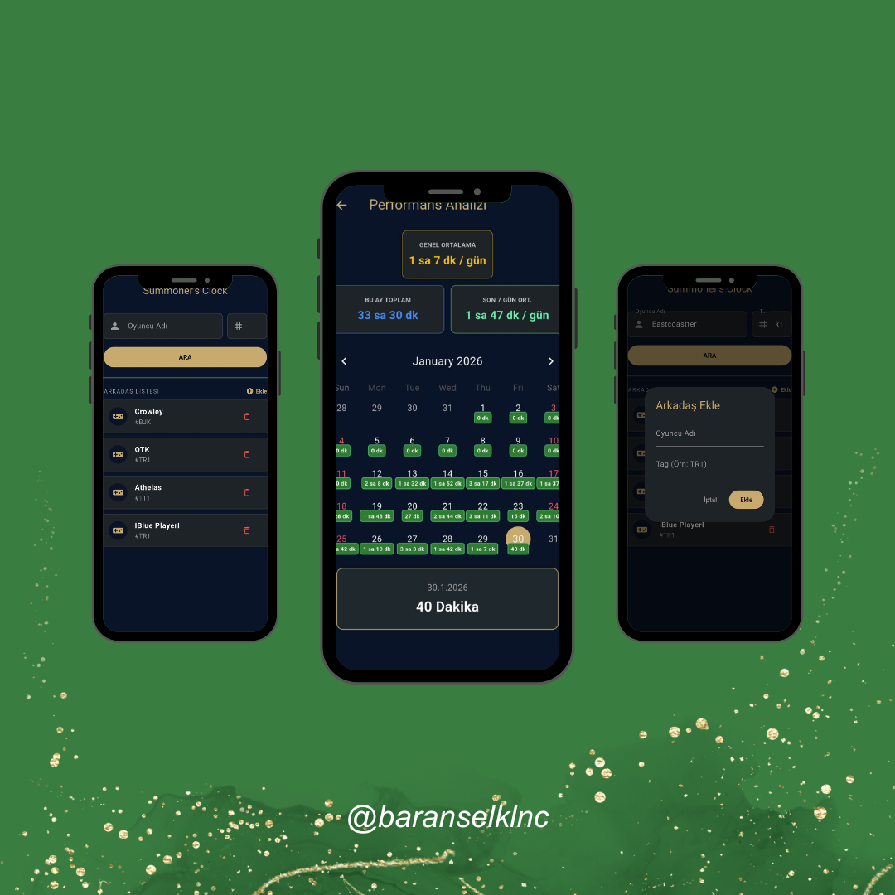

# 🎮 Summoner's Clock 

A Flutter application designed to track and visualize your daily League of Legends playtime using the Riot Games API. This app helps players monitor their gaming habits through an interactive calendar and detailed statistics, promoting better time management. A lightweight, high-performance utility application developed as a **rapid prototype** to visualize Riot Games API data.

While built as a weekend project to track League of Legends playtime, the architecture strictly enforces **clean code principles**, **secure configuration management**, and **optimized data persistence** strategies to ensure scalability and maintainability.
##  Features

* **Riot ID Integration:** Seamlessly search for any summoner using their Game Name and Tag Line.
* **Interactive Calendar:** View your match history and daily playtime on a clean, intuitive calendar interface.
* **Smart Caching:** Uses local storage (`SharedPreferences`) to save fetched data. This minimizes API calls, avoids rate limits, and allows offline viewing of past data.
* **Performance Analytics:**
    * **Global Average:** Your average daily playtime based on all recorded history.
    * **Monthly Total:** Total hours played in the currently selected month.
    * **Last 7 Days Average:** A rolling average of the past week to track recent habits.
* **Quick Access:** Fast-switch between favorite accounts (e.g., Main, Smurf, Friends).
* **Secure:** API keys are managed safely using `.env` configuration.

##  Screenshots

 

##  Key Technical Implementations

This project demonstrates several advanced engineering practices within a compact codebase:

* **Smart Caching & Rate Limit Optimization:**
    * Implemented a "Cache-First" strategy using `SharedPreferences`.
    * The app checks local storage before querying the Riot API. This drastically reduces network latency and ensures compliance with Riot's strict API rate limits (429 handling), while providing offline access to historical data.

* **Secure Configuration Management:**
    * Sensitive credentials (API Keys) are abstracted from the codebase using `.env` files and `flutter_dotenv`.
    * Ensures security best practices by preventing hardcoded secrets in version control.

* **Dynamic Data Serialization:**
    * Custom JSON parsing logic handles the serialization and deserialization of user favorites and match history, allowing for a seamless user experience across app restarts.

* **Algorithm & Data Analysis:**
    * Includes custom algorithms to calculate rolling averages (Last 7 Days) and aggregate monthly statistics from raw timestamp data, transforming complex API responses into actionable user insights.

* **Clean Architecture Principles:**
    * Separation of Concerns (SoC) is maintained by isolating UI (`screens`), Business Logic (`services`), and Configuration. This ensures the codebase is scalable and testable.

